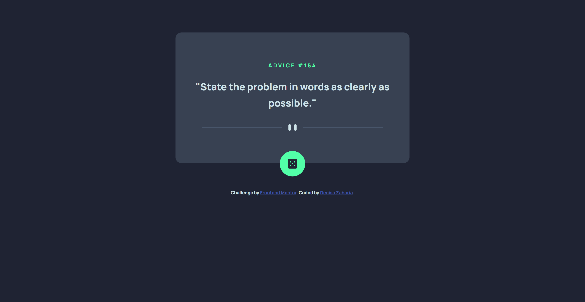
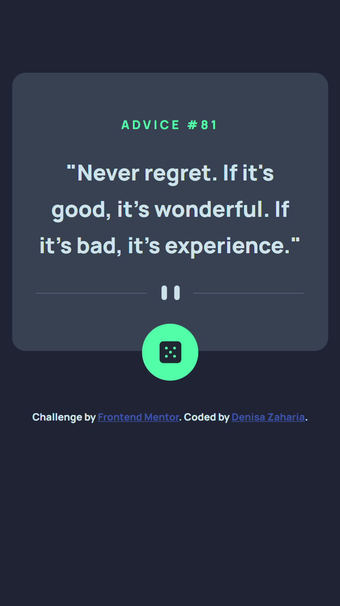

# Frontend Mentor - Advice generator app solution

This is a solution to the [Advice generator app challenge on Frontend Mentor](https://www.frontendmentor.io/challenges/advice-generator-app-QdUG-13db). Frontend Mentor challenges help you improve your coding skills by building realistic projects.

## Table of contents

- [Overview](#overview)
  - [The challenge](#the-challenge)
  - [Screenshot](#screenshot)
  - [Links](#links)
- [My process](#my-process)
  - [Built with](#built-with)
  - [What I learned](#what-i-learned)
  - [Continued development](#continued-development)
  - [Useful resources](#useful-resources)
- [Author](#author)

## Overview

### The challenge

Users should be able to:

- View the optimal layout for the app depending on their device's screen size
- See hover states for all interactive elements on the page
- Generate a new piece of advice by clicking the dice icon

### Screenshot





### Links

- Solution URL: [Add solution URL here](https://github.com/denisazaharia98/Frontend-Mentor-Challenges-Junior/tree/main/1.%20advice-generator-app-main)
- Live Site URL: [Add live site URL here](https://denisazaharia98.github.io/Frontend-Mentor-Challenges-Junior/1.%20advice-generator-app-main/)

## My process

### Built with

- Semantic HTML5 markup
- CSS custom properties
- Flexbox
- Mobile-first workflow
- JavaScript

### What I learned

```js
/* get the data from API with axios */
const getDataAPI = async () => {
  try {
    const res = await axios.get("https://api.adviceslip.com/advice");
    const advice = res.data.slip.advice;
    const id = res.data.slip.id;
    let valuesAPI = [];
    valuesAPI.push(id);
    valuesAPI.push(advice);
    return valuesAPI;
  } catch (e) {
    return "No advice available. Sorry!";
  }
};
```

### Continued development

I want to practice JavaScript by doing projects.

### Useful resources

- [Box shadow generator](https://html-css-js.com/css/generator/box-shadow/) - This tool helped me to make a shadow for a button in a short time.
- [Axios documentation](https://github.com/axios/axios) - Axios helped me to get the data from API.

## Author

- Frontend Mentor - [@denisazaharia98](https://www.frontendmentor.io/profile/denisazaharia98)
